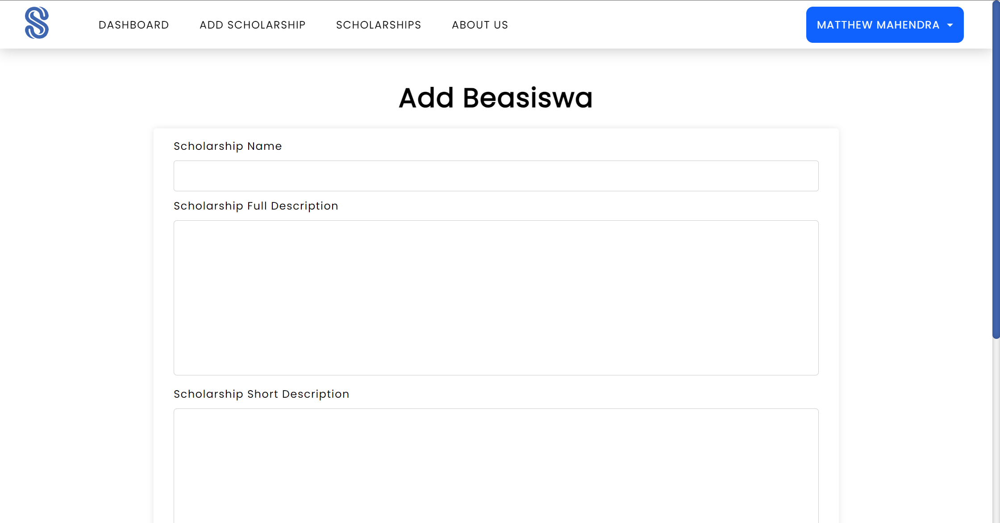

# Milestone 1 IF3110
## Website Name
Scholee

## Description
Get matched to Scholarships that fit you
Finding college scholarships shouldn't be overwhelming. We make it simple and match you to scholarships you qualify for. Imagine a world where students from all walks of life can access opportunities for education, where financial burdens no longer stand in the way of academic achievement. Our mission is to break down these barriers, opening the doors to knowledge and opportunity for all.

### Features
1. Find scholarships
2. Bookmark scholarships
3. Review documents needed for a scholarship. Documents will be reviewed by professionals

### Roles
1. Student: A student, normal user
2. Administrators: A scholarship administrator
3. Reviewer: A professional that can review documents uploaded by students
4. Super Admin: Website Administrator that could view all users

## Requirements
1. MariaDB
2. PHP 7.4
3. Web Browser (preferably Chromium)
4. Docker
5. XAMPP
6. MySQLi Extension for PHP

## How to Install
1. Install Docker from [here](https://www.docker.com/products/docker-desktop/)
2. Install XAMPP from [here](https://www.apachefriends.org/download.html)

## How to Run
### Using XAMPP
1. Place this project in the htdocs folder in XAMPP
2. Setup httpd.conf. Change the root DocumentRoot and Directory to 
```
[DRIVE]:/xampp/htdocs/[project folder] 
```
3. Setup the database using MySQL based DBMS
4. Configure the database access in .env file using .env.example
5. Run the XAMPP Control Panel and start the Apache Web Server, preferably as administrator
6. Access it in the web browser using localhost

### Using Docker
1. Run the Docker Desktop Application
2. Give the command at the root of this project
    ```
    docker-compose build
    ```
3. Configure the database access in .env file using .env.example according to the ``docker-compose.yml``
4. Give the command 
    ```
    docker-compose up
    ```
5. Access it in the browser using localhost with port 3000


## Developers
1. Henry Anand Septian Radityo - 13521004
2. Matthew Mahendra - 13521007
3. Ahmad Nadil - 13521024

## Screenshots
- Landing Page


- About Us


- Login


- Register


- Dashboard


- Scholarship List


- Scholarship View More


- Scholarship Bookmark


- Document Review


- Document Upload


- User Profile


- Add Scholarship


- Add User as Super Admin


- User List


## Lighthouse Report
Lighthouse report can be viewed at [here](docs/lighthouse/lighthouse.md)

## Responsive Web Design
Website is responsive to media size

## Task Allocation 

### Server Side
| Task                  | Responsible        |
| --------------------- | ------------------ |
| Login                 | 13521007, 13521024 |
| Register              | 13521004, 13521007, 13521024 |
| Password Reset           | 13521024                   |
| Account Verification     | 13521024                   |
| 404 Page                 | 13521024                   |
| Scholarships List     | 13521007, 13521024 |
| Scholarship View More | 13521024           |
| Scholarship Bookmark  | 13521007           |
| Scholarship Add       | 13521007           |
| Scholarship Update    | 13521007           |
| Scholarship Search    | 13521004, 13521024 |
| Bookmark Search       | 13521004, 13521007 |
| Student Documents     | 13521007           |
| Student Add           | 13521004           |
| Document Upload       | 13521007           |
| Document Review       | 13521007           |
| Profile View          | 13521007           |
| Profile Update        | 13521007           |
| Super Admin User List | 13521007, 13521024 |
| Super Admin User Search| 13521007, 13521024|
| Dashboard               | 13521004         |
| Docker                | 13521024      |
| MVC               | 13521004, 13521024 |
| Database              | 13521007           |


### Client Side
| Task                     | Responsible                |
|--------------------------|----------------------------|
| Login                    | 13521004, 13521024         |
| Register                 | 13521004, 13521024         |
| Password Reset           | 13521024                   |
| Account Verification     | 13521024                   |
| 404 Page                 | 13521024                   |
| Scholarships List        | 13521004, 13521007, 13521024         |
| Scholarship View More    | 13521024                   |
| Scholarship Bookmark     | 13521007                   |
| Scholarship Add          | 13521004, 13521007                   |
| Scholarship Update       | 13521004, 13521007                   |
| Scholarship Search       | 13521024                   |
| Scholarship Pagination   | 13521004, 13521024         |
| Bookmark Search          | 13521004                   |
| Student Documents        | 13521007                   |
| Document Upload          | 13521004, 13521007                   |
| Document Review          | 13521007                   |
| Profile View             | 13521004, 13521007         |
| Profile Update           | 13521004, 13521007         |
| Super Admin User List    | 13521007, 13521024         |
| Super Admin User Search  | 13521007, 13521024         |
| Dashboard                | 13521004                   |
| Landing Page             | 13521004,  13521007, 13521024                   |
| About Us Page            | 13521024                   |
| Navbar                   | 13521004, 13521024         |