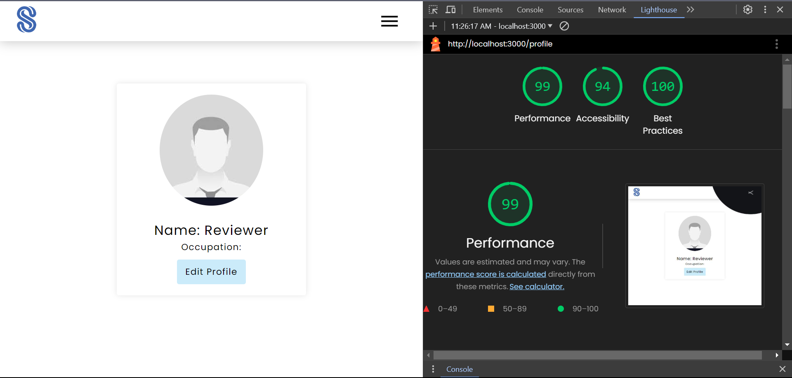
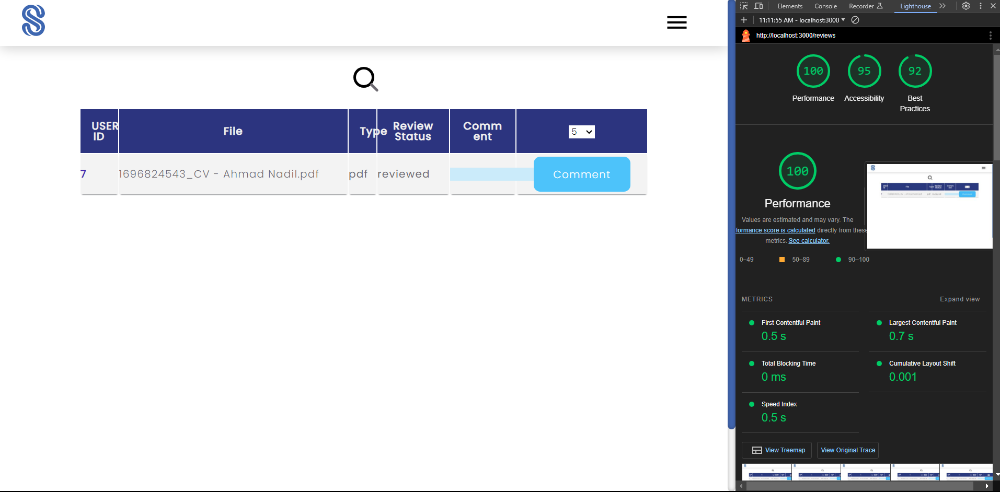

# Lighthouse Report
The Lighthouse report is generated for each page that are available. The test is performed for the categories Performance, ACcessibility, and Best Practices.

- Home

- Login

- Register

- Dashboard as Reviewer

- Dashboard as Reviewer

- Dashboard as Superadmin

- Dashboard as Student

- Editprofile as Reviewer

- Editprofile as Reviewer

- Editprofile as Superadmin

- Editprofile as Student

- Scholarship Add as Admin

- Scholarship List as Student

- Document Add as Student

- User Add as Superadmin

- User List as Superadmin

- Profile as Superadmin

- Profile as Reviewer

- Profile as Admin

- Profile as Student

- Review as Student

- Review as Reviewer

